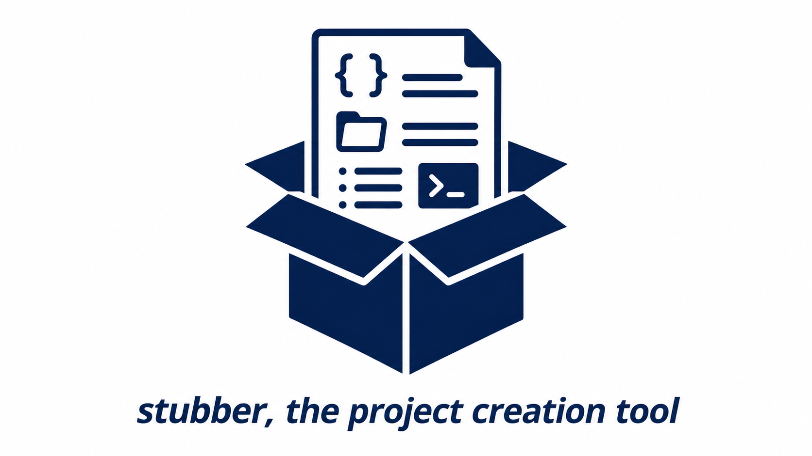

# stubber
___
A CLI tool that generates the directory structure, build scripts, and packaging
metadata for a new Go project, following a personal CI/CD convention: Alpine
(APK), Debian/Ubuntu (DEB), RHEL/Fedora (RPM), and Arch Linux (PKGBUILD)
packaging stubs, plus a ready-to-build Go skeleton.

Everything is generated from templates embedded in the binary
(`src/assets/`, embedded via `go:embed` in `src/assets/assets.go`), with
placeholders substituted at run time from the flags you pass.

---

## Contents

- [How it works](#how-it-works)
- [Installation](#installation)
- [Quick start](#quick-start)
- [Usage](#usage)
  - [Global flags](#global-flags)
  - [`create` flags](#create-flags)
  - [`refresh` flags](#refresh-flags)
  - [Examples](#examples)
- [The project manifest (`<softwarename>.json`)](#the-project-manifest-softwarenamejson)
- [Generated layout](#generated-layout)
  - [Skeleton (`-k`)](#skeleton--k)
  - [Alpine (`-a`)](#alpine--a)
  - [Debian (`-d`)](#debian--d)
  - [RedHat (`-r`)](#redhat--r)
  - [ArchLinux (`-A`)](#archlinux--a-1)
- [Template placeholders](#template-placeholders)
- [Assets management](#assets-management)
- [Shell completion](#shell-completion)
- [Building from source](#building-from-source)
- [Building packages](#building-packages)
- [Known issues / caveats](#known-issues--caveats)
- [License](#license)

---

## How it works

`stubber create` takes a software name and one or more "stub" flags
(`-A`, `-a`, `-d`, `-r`, `-k`). Each stub flag tells stubber which set of
templated files to render into the project directory. Other flags (`-V`,
`-D`, `-M`, `-u`, etc.) supply the values used to fill in the placeholders in
those templates.

At `create` time stubber also writes a small
[`<softwarename>.json` manifest](#the-project-manifest-softwarenamejson) into the
project root (e.g. `mytool.json`), recording every value it used. `stubber
refresh` reads that manifest so it can re-render selected stubs while
**preserving the values you don't override** — you only pass the flags you want
to change.

stubber only creates files — it does **not** initialize a git repository or
run `go mod init` for you. See [Caveats](#known-issues--caveats).

## Installation

Pre-built packages (`.apk`, `.deb`, `.rpm`, Arch `PKGBUILD`) are published on
the [Releases](https://github.com/jeanfrancoisgratton/stubber/releases) page.

Otherwise, build it yourself — see [Building from source](#building-from-source).

## Quick start

```sh
# Full project: Go skeleton + all four packaging stubs
stubber create -A -a -d -r -k \
  -V 1.0.0 -R 1 \
  -D "My awesome CLI tool" \
  -u "https://git.famillegratton.net:3000/jfgratton/mytool" \
  mytool
```

This creates a `mytool/` directory in the current working directory containing
a buildable Go skeleton plus `__archlinux/`, `__alpine/`, `__debian/`, and
`__redhat/` packaging stubs.

> **Always review the generated files.** stubber is a *generic* stub
> generator — it doesn't know anything about your project beyond what you
> pass on the command line.

## Usage

```sh
stubber [global flags] <command> [command flags] <args>
```

Available commands:

| Command      | Description                                                |
|--------------|-------------------------------------------------------------|
| `create`     | Generates the directory structure (skeleton/stubs) for a new software project |
| `refresh`    | Re-renders selected stubs of an existing project, preserving unset values (reads/updates `<softwarename>.json`) |
| `assets`     | Manage/inspect the templates embedded in the binary (e.g. `assets list`) |
| `completion` | Generates shell completion scripts (bash, zsh)             |

Run `stubber -h`, `stubber create -h`, or `stubber completion -h` for the
built-in help at any time.

### Global flags

These apply to `stubber` itself and are inherited by all subcommands:

| Flag | Shorthand | Default | Description |
|------|-----------|---------|-------------|
| `--quiet` | `-q` | `false` | Silence non-essential output. |
| `--projectrootdir` | `-p` | `.` | Directory in which to create the project. If left at the default, stubber creates and uses `./<SOFTWARENAME>`. If set to an existing path, stubber generates files directly into it. |
| `--binaryname` | `-b` | *(same as `<SOFTWARENAME>`)* | Name of the compiled binary. Used to name Alpine packaging scripts (`<binaryname>.post-install`, etc.) and as the `{{ BINARY NAME }}` placeholder. |
| `--gover` | `-g` | `1.26.4` | Go version to embed in generated files (`go.mod`, `go.version`, packaging scripts). *Despite the built-in help text, this sets the Go version — not an output path.* |
| `--version` | | | Print stubber's own version and the Go toolchain version it was built with. |
| `--help` | `-h` | | Show help for any command. |

### `create` flags

`stubber create` requires **exactly one** positional argument (the software
name), **at least one** of `-A`, `-a`, `-d`, `-r`, `-k`, and the three
mandatory value flags `-D`, `-s`, `-e`:

```sh
stubber create [-A] [-a] [-d] [-r] [-k] -D <desc> -s <section> -e <deps> [other flags] <SOFTWARENAME>
```

| Stub flag | Shorthand | What it generates |
|-----------|-----------|--------------------|
| `--archlinux` | `-A` | `__archlinux/` — `PKGBUILD` + build helper scripts (Arch Linux) |
| `--alpine`    | `-a` | `__alpine/` — `APKBUILD` + install/upgrade/deinstall scripts |
| `--debian`    | `-d` | `__debian/` — control file, build scripts, maintainer scripts |
| `--redhat`    | `-r` | `__redhat/` — spec file, `Makefile`-driven RPM build, changelog helper |
| `--skeleton`  | `-k` | Go project skeleton: `src/`, `go.mod`, `main.go`, `cmd/root.go`, `cmd/completion.go`, build scripts, `README.md`, `CHANGELOG.md`, `LICENSE`, etc. |

Value flags used to fill in the templates. `-D`, `-s`, and `-e` are
**mandatory** on `create` (marked ⭑ below) — even the ones with a default must
be supplied explicitly:

| Flag | Shorthand | Default | Description |
|------|-----------|---------|-------------|
| `--packagever` | `-V` | *(empty)* | Package version number — `{{ PACKAGE VERSION }}`. |
| `--packagerel` | `-R` | *(empty)* | Package release number — `{{ PACKAGE RELEASE }}`. |
| `--desc` ⭑ | `-D` | *(empty)* | **Required.** Package description — `{{ DESCRIPTION }}`. |
| `--maintainer` | `-M` | `Jean-Francois Gratton <jean-francois@famillegratton.net>` | Maintainer name/email — `{{ MAINTAINER }}`. **Override this if you're not me.** |
| `--packager` | `-P` | `APK Builder <builder@famillegratton.net>` | Packager name/email (Alpine) — `{{ PACKAGER }}`. **Override this too.** |
| `--section` ⭑ | `-s` | `Packaging tool` | **Required.** Debian package section / RPM `Group` — `{{ PACKAGE SECTION }}` / `{{ SECTION }}`. |
| `--depends` ⭑ | `-e` | *(empty)* | **Required.** Package dependencies, passed straight into the Debian `control` file — `{{ DEPENDENCIES }}`. |
| `--url` | `-u` | `https://git.famillegratton.net:3000/ADD_URL_HERE` | Upstream/git repo URL — `{{ URL }}`. **Override this.** |

> These three are required on **`create`** only. `refresh` leaves them optional,
> since it preserves whatever the manifest already holds.

### `refresh` flags

`stubber refresh` re-renders the stubs of an *existing* project. It reads the
[`<softwarename>.json` manifest](#the-project-manifest-softwarenamejson) written
at `create` time, applies only the flags you actually pass on the command line
(everything else keeps its stored value), regenerates the requested stubs, and
writes the updated manifest back.

```sh
stubber refresh [-A] [-a] [-d] [-r] [-k] [value flags]
```

`refresh` takes **no positional argument**. Run it **from the project root** —
the directory that holds `<softwarename>.json` — and stubber discovers the single
manifest there (a `.json` whose contents name themselves), reading the software
name from it. You can point `-p` at that directory instead of `cd`-ing into it.
If the directory has no manifest (or more than one), `refresh` stops with an
error rather than guessing.

Which stubs get refreshed is driven entirely by the stub flags you pass:

| Stub flag | Shorthand | Effect on `refresh` |
|-----------|-----------|---------------------|
| `--archlinux` | `-A` | Re-render `__archlinux/` (created if missing) |
| `--alpine`    | `-a` | Re-render `__alpine/` (created if missing) |
| `--debian`    | `-d` | Re-render `__debian/` (created if missing) |
| `--redhat`    | `-r` | Re-render `__redhat/` (created if missing) |
| `--skeleton`  | `-k` | Re-render **`go.version` only** (see below) |

- **Pass at least one stub flag.** If you pass none, `refresh` does nothing and
  says so — it never guesses which stubs to touch.
- Stubs you *don't* pass are left completely untouched. So `refresh -d` rewrites
  only `__debian/`, even if the project also has `__archlinux/`, `__redhat/`, etc.
- **`-k` is deliberately conservative**: it re-renders only `go.version`. It will
  **never** overwrite your real source (`src/main.go`, `src/cmd/root.go`, …) or
  your edited docs (`README.md`, `CHANGELOG.md`, …), even though `create -k`
  generates those files.

The value flags (`-g`, `-V`, `-R`, `-D`, `-M`, `-P`, `-s`, `-e`, and `-b`) work
exactly as in `create`, but here **omitting a flag means "keep the stored
value"** rather than "use the default". Note that `-u`/`--url` is *not* a
`refresh` flag — the URL is preserved from the manifest but can't be changed via
`refresh` (edit `<softwarename>.json` or the generated files directly if you need to).

### Examples

Generate just a Go skeleton, targeting Go 1.26.4, in a custom directory
(`-D`/`-s`/`-e` are required on every `create`, even skeleton-only):

```sh
stubber create -k -g 1.26.4 -D "My awesome CLI tool" -s "utils" -e "" -p ./projects/mytool mytool
```

Add Debian packaging to an existing project, with dependencies:

```sh
stubber create -d \
  -D "Backup helper for Docker volumes" \
  -s "admin" \
  -e "docker.io" \
  -M "Your Name <you@example.com>" \
  dvol
```

Generate RPM packaging only (`__redhat/`), with version/release set explicitly:

```sh
stubber create -r -V 2.3.0 -R 1 -D "My project" -s "utils" -e "" -u "https://git.example.com/me/myproj" myproj
```

Generate an Arch Linux `PKGBUILD` stub (`__archlinux/`):

```sh
stubber create -A -V 0.1.0 -R 1 -D "My awesome CLI tool" -s "utils" -e "" mytool
```

Generate everything quietly (e.g. from a script), with a binary name that
differs from the project name:

```sh
stubber -q create -A -a -d -r -k -b mytoolctl -V 0.1.0 -R 1 -D "My tool" -s "utils" -e "" mytool
```

Bump the version and Go toolchain of an existing project, refreshing every
packaging stub it already has (run from inside the project root, no name needed):

```sh
cd mytool
stubber refresh -A -a -d -r -V 1.1.0 -R 1 -g 1.27.0
```

Change just the Debian dependencies, leaving everything else as-is (pointing
`-p` at the project instead of `cd`-ing in):

```sh
stubber refresh -d -e "docker.io, ca-certificates" -p ./mytool
```

Re-point only `go.version` at a new Go release, without touching any packaging
or source files:

```sh
stubber refresh -k -g 1.27.0 -p ./mytool
```

## The project manifest (`<softwarename>.json`)

Every `stubber create` run writes a `<softwarename>.json` file into the project
root (for a project named `mytool`, that's `mytool.json`). It is a lossless
record of the values used to render the stubs, plus which stubs the project
owns:

```json
{
  "softwarename": "mytool",
  "binaryname": "mytool",
  "goversion": "1.26.4",
  "versionnumber": "1.0.0",
  "releasenumber": "1",
  "description": "My awesome CLI tool",
  "maintainer": "Your Name <you@example.com>",
  "packager": "APK Builder <builder@famillegratton.net>",
  "section": "Packaging tool",
  "dependencies": "",
  "url": "https://git.example.com/me/mytool",
  "stubs": {
    "alpine": true,
    "debian": true,
    "redhat": true,
    "archlinux": true,
    "skeleton": true
  }
}
```

`stubber refresh` reads this file to recover the values for any flag you don't
pass, then rewrites it after a successful refresh (updating changed values and
recording any newly added stub type). This is why omitted flags are *preserved*
rather than reset — and why `refresh` needs no software name on the command
line: it discovers `<softwarename>.json` in the project root and reads the name
from there.

Keep `<softwarename>.json` under version control alongside the project. If it's
missing (e.g. a project created before this feature existed), `refresh` stops
with a "No manifest found" error and exits non-zero rather than guessing — it
never falls back to defaults, because that would silently overwrite your
metadata with empty/wrong values. To recover, hand-write a minimal manifest (the
JSON above is the full shape) or re-run `create`.

## Generated layout

The exact set of files generated depends on which of `-A` / `-a` / `-d` /
`-r` / `-k` you pass. Combined, a full run (`-A -a -d -r -k`) produces:

```
.
├── __alpine/
│   ├── APKBUILD
│   ├── <binary>.post-install
│   ├── <binary>.pre-install
│   ├── <binary>.pre-upgrade
│   ├── <binary>.post-upgrade
│   ├── <binary>.pre-deinstall
│   └── <binary>.post-deinstall
├── __archlinux/
│   ├── 1.install-build-deps.sh
│   ├── 2.build-package.sh
│   └── PKGBUILD
├── __debian/
│   ├── 1.install-build-deps.sh
│   ├── 2.build_binary.sh
│   ├── 3.restore_repo.sh
│   ├── control
│   ├── preinst
│   ├── postinst
│   ├── prerm
│   └── postrm
├── __redhat/
│   ├── <SOFTWARENAME>.spec
│   ├── Makefile
│   ├── PACKAGE_RPM.md
│   ├── rpmbuild-deps.sh
│   └── updateChangelog.sh
├── .gitignore
├── <SOFTWARENAME>.json
├── CHANGELOG.md
├── ISSUES.md
├── LICENSE
├── README.md
├── go.version
└── src
    ├── build.sh
    ├── go.mod
    ├── main.go
    ├── updateBuildDeps.sh
    └── cmd
        ├── completion.go
        └── root.go
```

### Skeleton (`-k`)

A minimal but buildable Go project: `src/main.go`, `src/cmd/root.go` (a Cobra
root command), `src/cmd/completion.go` (bash/zsh completion subcommand),
`src/go.mod`, plus `build.sh` / `updateBuildDeps.sh` helper scripts and the
usual `README.md` / `CHANGELOG.md` / `ISSUES.md` / `LICENSE` / `.gitignore` /
`go.version` files at the project root.

### Alpine (`-a`)

`__alpine/APKBUILD` plus one maintainer script per package lifecycle hook
(`post-install`, `pre-install`, `pre-upgrade`, `post-upgrade`, `pre-deinstall`,
`post-deinstall`), each named `<binaryname>.<hook>` and made executable.

### Debian (`-d`)

`__debian/control` plus build helper scripts (`1.install-build-deps.sh`,
`2.build_binary.sh`, `3.restore_repo.sh`) and maintainer scripts (`preinst`,
`postinst`, `prerm`, `postrm`), all made executable.

### RedHat (`-r`)

As of stubber v2.00.00, RPM packaging lives entirely under `__redhat/` and is
driven by a `Makefile` instead of `tito`:

| File | Purpose |
|------|---------|
| `<SOFTWARENAME>.spec` | The RPM spec file |
| `Makefile` | Drives the build (`tarball`, `rpm`, `rpmcl`, `upload`, `commitcl`, `clean` targets) |
| `rpmbuild-deps.sh` | Installs `BuildRequires` from the spec, plus the Go toolchain |
| `updateChangelog.sh` | Appends a `%changelog` entry from `git log` since the last tag |
| `PACKAGE_RPM.md` | Short walkthrough of the build workflow |

Typical workflow (from `__redhat/`):

```sh
make rpm        # build the RPM (tarball + rpmbuild -bb)
# or:
make rpmcl      # same, plus updates the spec's %changelog
make upload     # optional: push to a Nexus Repository Manager via nxtools
make commitcl   # commit the updated %changelog
git push
```

### ArchLinux (`-A`)

New in stubber v2.00.00. Generates `__archlinux/`:

| File | Purpose |
|------|---------|
| `PKGBUILD` | Standard Arch package build recipe (`makepkg`) |
| `1.install-build-deps.sh` | Installs `base-devel` via `pacman` |
| `2.build-package.sh` | Runs `makepkg --force --syncdeps --noconfirm` and cleans up `src/`/`pkg/` |

Typical workflow (from `__archlinux/`):

```sh
./1.install-build-deps.sh   # once, to get base-devel
./2.build-package.sh        # builds the package via makepkg, output to /data
```

> See [Known issues / caveats](#known-issues--caveats) — the generated
> `PKGBUILD` currently leaves `{{ URL }}` unsubstituted, and its `license=`
> field doesn't match this project's actual license.

## Template placeholders

If you customize the templates under `src/assets/` (see
[Building from source](#building-from-source)), these are the placeholders
stubber substitutes, and which flag/value feeds each one:

| Placeholder | Source | Used by |
|-------------|--------|---------|
| `{{ SOFTWARE NAME }}` | The `<SOFTWARENAME>` positional argument | all stubs |
| `{{ BINARY NAME }}` | `-b` / `--binaryname` (defaults to software name) | alpine, redhat, archlinux, skeleton |
| `{{ PACKAGE VERSION }}` | `-V` / `--packagever` | all stubs |
| `{{ PACKAGE RELEASE }}` | `-R` / `--packagerel` | all stubs |
| `{{ DESCRIPTION }}` | `-D` / `--desc` | all stubs |
| `{{ MAINTAINER }}` | `-M` / `--maintainer` | alpine, debian |
| `{{ PACKAGER }}` | `-P` / `--packager` | alpine only |
| `{{ SECTION }}` / `{{ PACKAGE SECTION }}` | `-s` / `--section` | redhat (`Group`), debian (`Section`), skeleton |
| `{{ DEPENDENCIES }}` | `-e` / `--depends` | debian only |
| `{{ URL }}` | `-u` / `--url` | alpine, redhat — **not currently wired up for archlinux** (see caveats) |
| `{{ GO VERSION }}` | `-g` / `--gover` | alpine, debian, redhat, skeleton |
| `{{ GO MAJOR MINOR }}` | Derived from `{{ GO VERSION }}` (e.g. `1.26.4` → `1.26`) | skeleton (`go.mod`) |
| `{{ ARCHITECTURE }}` | Hardcoded `amd64` (Debian); Alpine maps `amd64` → `x86_64` internally; Arch/RPM hardcode `x86_64` in their templates | debian |
| `{{ RELEASE DATE }}` | Today's date (`YYYY.MM.DD`), generated automatically | alpine, debian, redhat, skeleton |

## Assets management

`stubber assets list` (alias `ls`) prints every template asset embedded in
the binary — handy for checking what's available, or for sanity-checking
after editing `src/assets/`:

```sh
stubber assets list
```

## Shell completion

stubber can generate Bash and Zsh completion scripts via Cobra:

```sh
# Bash, current session
source <(stubber completion bash)

# Bash, persistent
stubber completion bash | sudo tee /etc/bash_completion.d/stubber > /dev/null

# Zsh, current session
source <(stubber completion zsh)

# Zsh, persistent
stubber completion zsh > ~/.zsh/stubber
echo 'fpath=($HOME/.zsh $fpath)' >> ~/.zshrc
echo 'autoload -Uz compinit && compinit' >> ~/.zshrc
```

Fish/PowerShell completions are not provided.

As of v2.01.00, projects generated with `-k` also include their own
`src/cmd/completion.go`, so software built from the skeleton gets the same
`completion bash`/`completion zsh` subcommands for free.

## Building from source

```sh
git clone https://github.com/jeanfrancoisgratton/stubber.git
cd stubber/src
./build.sh
```

`build.sh` just runs `go build` — there's no separate asset-bundle
regeneration step. Templates under `src/assets/` (organized into `apk/`,
`arch/`, `deb/`, `rpm/`, and `skeleton/`) are embedded directly via
`//go:embed` in `src/assets/assets.go`, so editing a template and rebuilding
is enough. `src/assets/template_handler.go` (`assets.ProcessEmbeddedAsset`)
reads an embedded asset, substitutes placeholders, and writes it into the
generated project tree.

The required Go version is tracked in `go.version` at the repo root
(currently 1.26.5).

## Building packages

The `__alpine/`, `__archlinux/`, `__debian/`, and `__redhat/` directories at
the repo root are stubber's *own* packaging stubs (generated by stubber, for
itself — dogfooding). The RPM workflow is documented in
[`__redhat/PACKAGE_RPM.md`](__redhat/PACKAGE_RPM.md); the Alpine/Arch/Debian
stubs assume the author's home-lab build containers, which aren't published.

If you'd rather not build from source, grab a pre-built package from the
[Releases](https://github.com/jeanfrancoisgratton/stubber/releases) page.

## Known issues / caveats

- stubber creates a directory structure, but does **not** initialize a git
  repository (or any other VCS) for you.
- After running `stubber create -k`, `go.mod` / `go.sum` in the generated
  skeleton may need a `go mod init` / `go mod tidy` pass before `src/build.sh`
  will succeed.
- **ArchLinux (`-A`)**: the generated `PKGBUILD` leaves `{{ URL }}`
  unsubstituted (the placeholder isn't currently in `stubArchLinux`'s
  replacement map), so `url="{{ URL }}"` will appear literally in the output
  — edit it by hand for now.
- **ArchLinux (`-A`) / RedHat (`-r`)**: the generated `PKGBUILD` declares
  `license=('GPL-2.0-only')` and the `.spec` declares `License: GPL2.0`,
  which doesn't match this project's actual GPL-3.0 license. Double-check the
  license metadata in generated packaging files before publishing.
- Mainly tested on x86_64/amd64. Lightly tested on Apple Silicon (arm64);
  generated files may need extra tweaking on other architectures.
- The `-g`/`--gover` flag's built-in `-h` description is misleading (it says
  "Where to put the skeleton dir") — it actually sets the Go version used in
  generated files.
- **Always review the generated files.** This is a generic stub generator; it
  doesn't validate the values you pass, and downstream packaging tools (`apk`,
  `dpkg-buildpackage`, `rpmbuild`, `makepkg`) are unforgiving of malformed
  metadata.

See [ISSUES.md](ISSUES.md) for the current open-issue tracker.

## License

[GPL-3.0](LICENSE)
